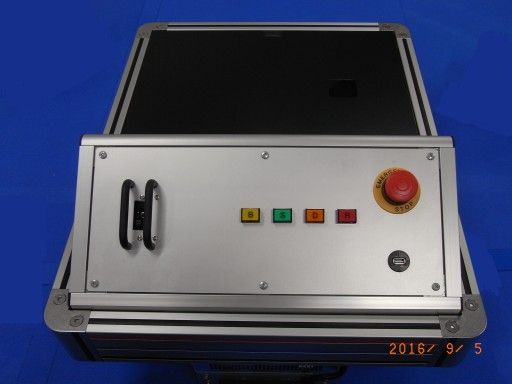
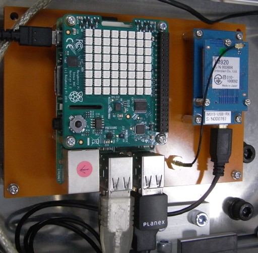

# m34_agv_raspi
2016年の物流展向けAGVデモ機用ROSプログラム。  
AGVに搭載したRaspberryPi上のROSで動作する。

1.hardware

種別|品名
----|----
PC| RaspberryPi2(8GB SD)
LED|Sense HAT(LEDのみ使用)
5GHz Wi-Fi|Planex GW-450D2
920MHz Wireless|Interplan IM920XT + IM315-USB-RX
USB-Serial|ATEN UC-232A

2.serial device rules

ベンダID|デバイス名
----|----
10c4|/dev/abh3
0557|/dev/plc
0403|/dev/im920

3.ROS node

ノード名|ソース名|内容
----|----|----
abh3|abh3.py|ABH3モータ・ドライバから各種情報を読み出す
plc|plc.py|PLCから各種情報を読み出す
mqtt|mqtt.py|ABH3/PLCの情報をまとめてMQTTサーバへ転送
im920s|im920s.py|ABH3/PLCの情報をまとめてIM920より送信
led|led.py|PLCからの番地情報をLEDに表示
